# ABC Learning Platform - Frontend (React, Laravel, MySQL, FFmpeg)

## Introduction
The ABC Learning Platform is an innovative e-learning solution designed to empower students and professionals to achieve their career goals, inspired by platforms like Udemy. Built for ABC Technologies, it serves over **10,000 students** with features like course subscriptions, interactive video lessons, assessments, an inbuilt code editor, Q&A forums, certificate generation, and job/internship opportunities. This repository contains the frontend, developed using **React.js**, providing a dynamic, responsive interface. The backend, built with **Laravel** and **MySQL**, is available at [abc-backend-lrs](https://github.com/ravirajladha/abc-backend-lrs). Developed at KODS.Tech, this project showcases my expertise in frontend development, API integration, and UX design, complementing my portfolio projects like `DigitalDoctorClinic` and `VishvinStockManagement`.

## Technologies
- **Frontend**: React.js, Bootstrap, JavaScript, Axios
- **Database**: MongoDB (for specific features)
- **Tools**: Git, GitHub, Postman, Asana, Slack
- **Infrastructure**: AWS (deployment), Personal Server (demo hosting)

## Key Features
### For Students
- **Course Subscription**: Explore and subscribe to courses tailored to interests.
- **Learning and Assessment**:
  - Engage with video lessons, eBooks, and mini-projects.
  - Complete tests and assessments via an inbuilt code editor.
- **Certificate Generation**: Earn certificates upon course completion.
- **Interactive Tools**:
  - Participate in Q&A sessions with trainers.
  - Save notes and discuss topics in forums (with voting for top answers).
- **Internships & Jobs**:
  - Apply for internships with task submissions using the code editor.
  - Apply for jobs posted by trainers after passing preliminary tests.

### For Admins
- Monitor course enrollments, Q&A, and forum activities through dashboards.
- Generate platform performance insights.

### For Trainers
- Track student progress and engagement via interactive dashboards.
- Engage with students through Q&A and forum discussions.

### For Recruiters
- Review candidate profiles and test submissions for job openings.

## Contributions
- Designed and developed the **responsive frontend** using React.js and Bootstrap, enhancing UX for **10,000+ students**.
- Integrated **RESTful APIs** with Axios for seamless data exchange with the Laravel backend.
- Implemented **interactive features** like the inbuilt code editor, Q&A, and forums, with researched UX for engagement.
- Managed tasks via **Asana** and collaborated on **Slack**, delivering a scalable interface.

## Screenshots
### Student Features
- **Dashboard**: Overview of enrolled courses, progress, and certifications.
  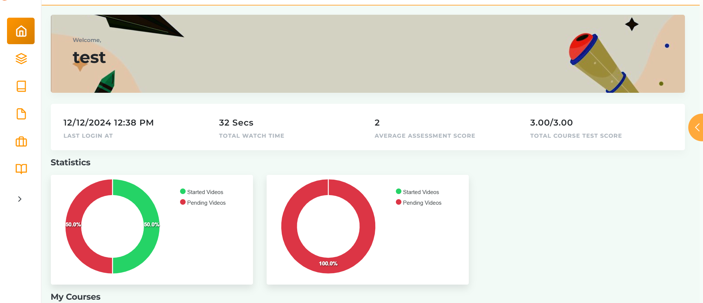
- **Course Page**: Video lessons, assessments, and forums.
  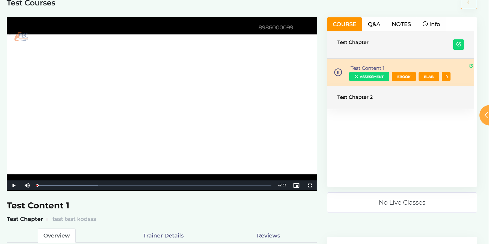
- **Code Editor**: Built-in IDE for tasks and mini-projects.
  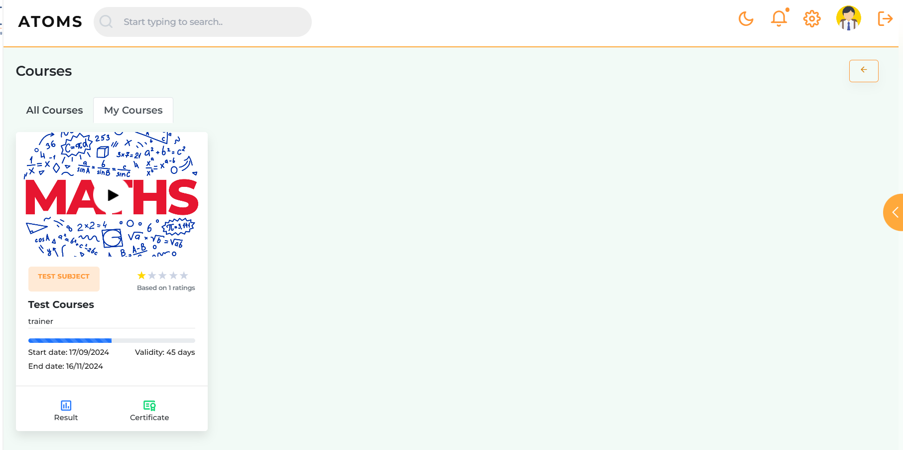

### Admin Features
- **Course Management**: Add, edit, or delete courses and associated details.
  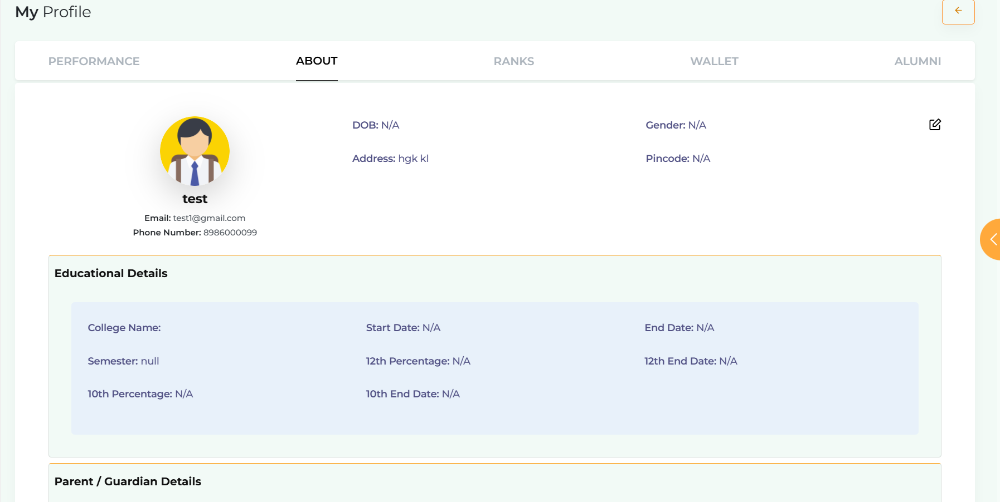
- **Monitoring**: Dashboard showing platform metrics.
  

### Trainer Features
- **Student Management**: Track and evaluate student progress.
  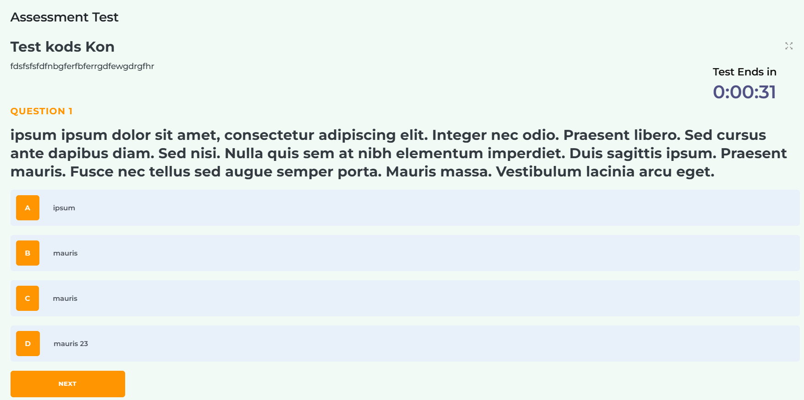


### Recruiter Features
- **Job Posting**: Interface to post and manage job opportunities.
  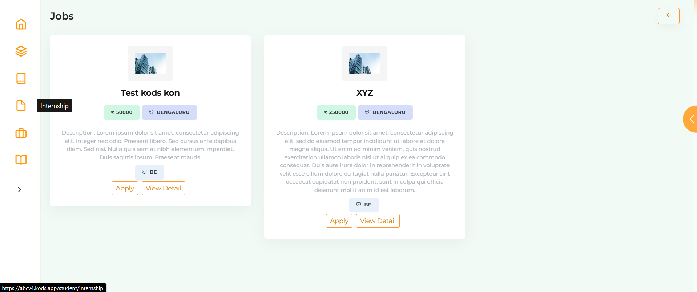
- **Candidate Evaluation**: Others.
  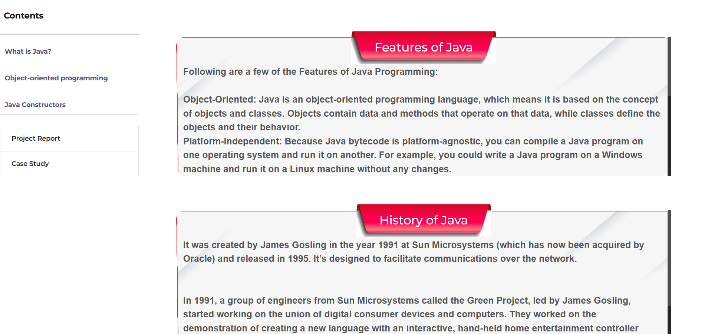
  - **Candidate Evaluation**: Others.
    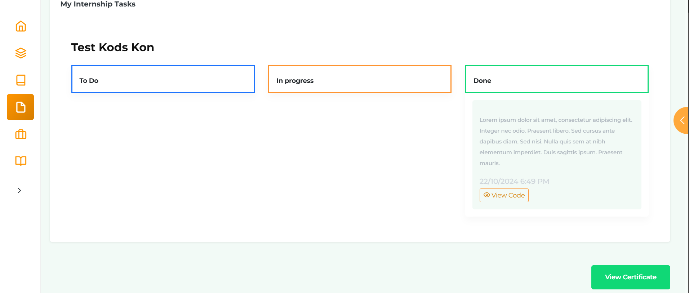
  - **Candidate Evaluation**: Others.
    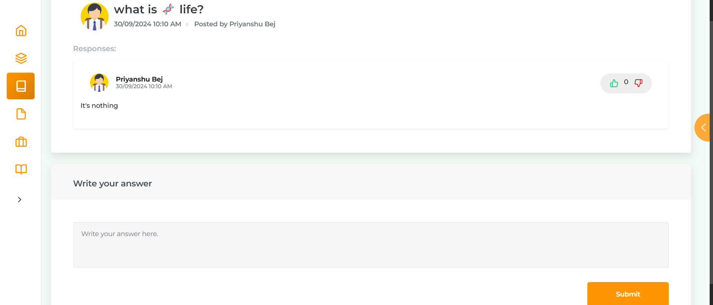
  - **Candidate Evaluation**: Others.
    
  - **Candidate Evaluation**: Others.
    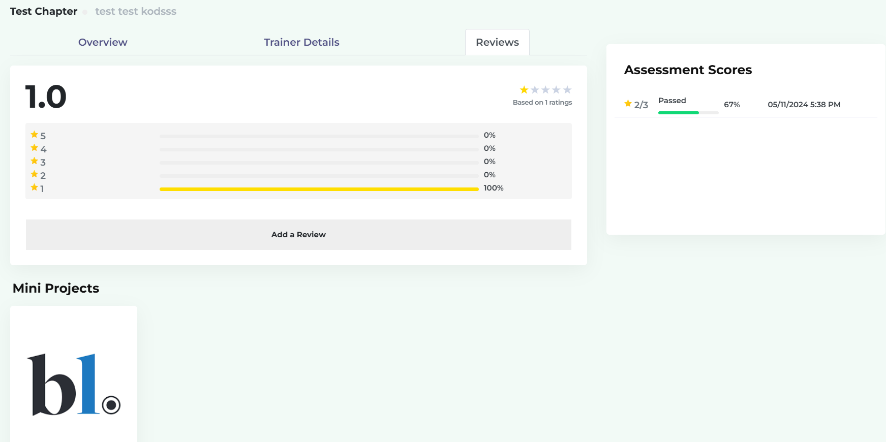
  - **Candidate Evaluation**: Others.
    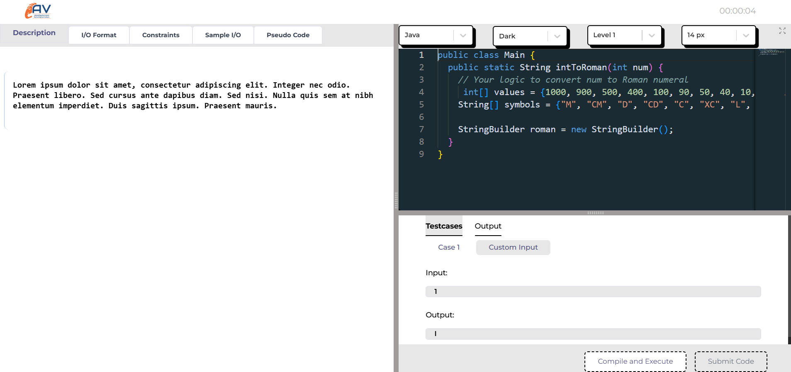
  - **Candidate Evaluation**: Others.
    
  - **Candidate Evaluation**: Others.


## Prerequisites
- Node.js >= 16.x
- NPM
- Backend server (see [abc-backend-lrs](https://github.com/ravirajladha/abc-backend-lrs))

## Installation
1. **Clone the Repository**:
   ```bash
   git clone https://github.com/ravirajladha/abc-frontend-lrs.git
   cd abc-frontend-lrs
   ```
   On Windows:
   ```powershell
   git clone https://github.com/ravirajladha/abc-frontend-lrs.git
   cd abc-frontend-lrs
   ```
2. **Install Dependencies**:
   ```bash
   npm install
   ```
3. **Configure Environment**:
   - Create a `.env` file based on `.env.example`:
     ```bash
     copy .env.example .env
     ```
   - Update `.env` with backend API URL:
     ```
     REACT_APP_API_URL=http://localhost:8000/api
     ```
4. **Start the Development Server**:
   ```bash
   npm start
   ```
   Access at `http://localhost:3000`.

## Using .gitignore
- The `.gitignore` file excludes sensitive files (e.g., `.env`, `node_modules`).
- Apply it:
  ```bash
  git add .gitignore
  git commit -m "Add .gitignore"
  ```
  On Windows:
  ```powershell
  git add .gitignore
  git commit -m "Add .gitignore"
  ```
- Remove tracked sensitive files:
  ```bash
  git rm --cached .env
  git rm --cached node_modules/*
  git commit -m "Remove sensitive files"
  ```

<!-- ## Demo
Explore ABC Learning Platform’s features through a demo series: [ABC Learning Demo Series](https://www.youtube.com/playlist?list=YOUR_PLAYLIST_ID)  
Videos cover:
1. Responsive course dashboards and navigation
2. Interactive code editor and Q&A forums
3. Job and internship application workflows

Demo: [https://avatoms.ravirajladha.com](https://avatoms.ravirajladha.com) -->

## Testing
- Run unit tests:
  ```bash
  npm test
  ```
- Use Postman to test API endpoints (requires backend server).
- Manually test course enrollment, code editor functionality, and UI responsiveness.

## License
This project is licensed under the **MIT License**. See the [LICENSE](LICENSE) file for details.

## Contact
For questions or feedback, reach out to [Ravi Raj Ladha](mailto:ravirajladha@gmail.com).